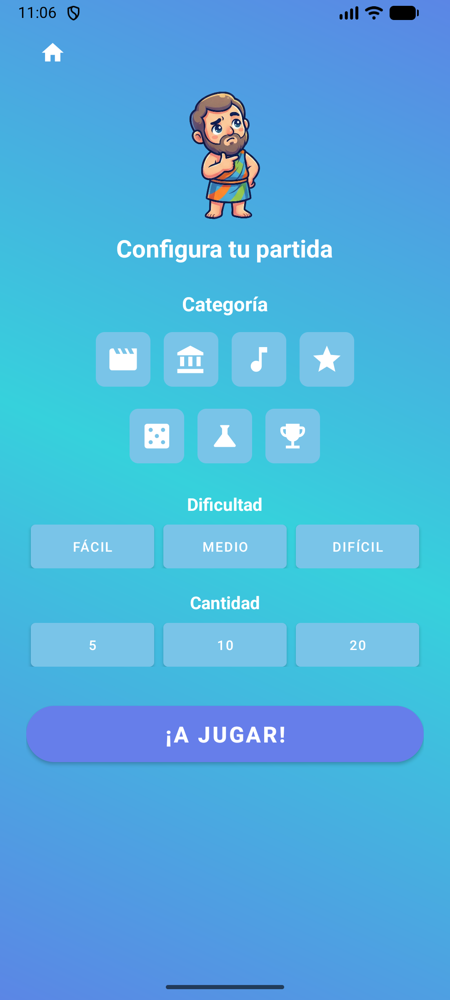
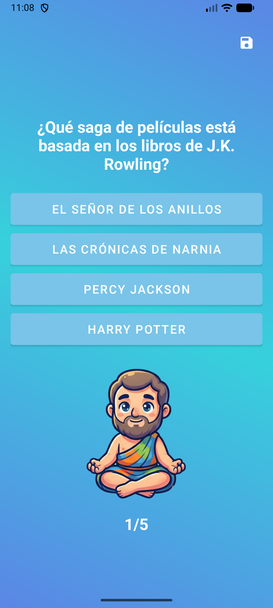

# WhoKnowsIt

**WhoKnowsIt** es un videojuego de trivia desarrollado en **Android nativo**, enfocado en poner a prueba los conocimientos del jugador en distintas categorías mediante partidas configurables y un sistema de guardado.

El objetivo del proyecto es aplicar conceptos de desarrollo móvil en Android,
poniendo en práctica principios SOLID, junto con el manejo de estado y persistencia de datos, mediante la implementación de un videojuego funcional.

## Descripción general
WhoKnowsIt es un juego de preguntas y respuestas para **un solo jugador (Single Player)**. El usuario puede configurar cada partida eligiendo:

* Categoría
* Dificultad
* Número de preguntas

El objetivo es responder correctamente la mayor cantidad de preguntas posibles y obtener el mejor puntaje.

## Jugabilidad

### Flujo del juego

1.  **Inicio:** Desde el menú principal, el jugador puede seleccionar **Nuevo Juego** o **Cargar Partida** (si existe una partida guardada).
2.  **Configuración:** Antes de comenzar, el jugador define la categoría, dificultad y cantidad de preguntas.
3.  **Partida:**
    *   Se muestra una pregunta a la vez.
    *   El jugador selecciona una respuesta.
    *   El juego muestra retroalimentación inmediata (correcto / incorrecto).
    *   Mientras no sea la última pregunta, el jugador puede guardar la partida.
4.  **Finalización:**
    *   Al responder la última pregunta, se muestra la pantalla de resultados.
    *  Si la partida fue cargada desde un guardado, este se elimina automáticamente al finalizar.

## Interfaz del juego

Pantallas principales que conforman la experiencia de usuario:

| Pantalla principal | Configuración de partida | Pantalla de pregunta |
|-------------------|-------------------------|----------------------|
|  |  |  |
| *Figura 1. Pantalla principal del juego.* | *Figura 2. Configuración de la partida.* | *Figura 3. Pantalla de pregunta.* |

| Resultado correcto | Resultado incorrecto |
|-------------------|----------------------|
|  |  |
| *Figura 4. Resultado al responder correctamente.* | *Figura 5. Resultado al responder incorrectamente.* |

## Videos de demostración

*   [Flujo completo del juego](docs/videos/full_gameplay.mp4)
*   [Guardar y cargar partida](docs/videos/save_load_demo.mp4)

## Controles

La interacción es completamente táctil:

*   **Responder:** Tocar una de las 4 opciones disponibles.
*   **Guardar partida:** Icono de guardar en la barra superior (no disponible en la última pregunta).

## Arquitectura

### Enfoque arquitectónico
El proyecto inició sin una arquitectura explícita. Conforme creció la complejidad,
utilicé apoyo de herramientas de IA para analizar y definir una estructura más adecuada, refactorizando el código hacia una **arquitectura por capas** basada en principios SOLID, con el objetivo de mejorar la separación de responsabilidades y la mantenibilidad del proyecto.

### Capas del sistema

* **UI (Presentation Layer):**  
  Activities encargadas únicamente de renderizar el estado  
  (`MainActivity`, `GameActivity`, `QuestionActivity`, etc.).

* **Domain (Business Logic):**  
  Reglas del juego y lógica de negocio  
  (`GameController`, `QuestionManager`, `SaveManager`, `ScoreManager`, `SoundManager`).

* **Data (Data Layer):**  
  Fuentes de datos y acceso a información  
  (`QuestionDataSource`, `LocalQuestionDataSource`).

* **Core / App:**  
  Modelos, configuración y estado global del juego  
  (`GameState`, `GameConfig`, enums, `WhoKnowsItApplication`).

## Estructura del proyecto
```
com.example.whoknowsit
├── core
│   ├── enums
│   │   ├── Category.kt
│   │   ├── Difficulty.kt
│   │   └── GameMode.kt
│   ├── GameConfig.kt
│   ├── GameController.kt
│   └── GameState.kt
├── data
│   ├── models
│   │   └── Question.kt
│   ├── LocalQuestionDataSource.kt
│   └── QuestionDataSource.kt
├── domain
│   ├── QuestionManager.kt
│   ├── SaveManager.kt
│   ├── ScoreManager.kt
│   └── SoundManager.kt
├── ui
│   ├── FeedbackActivity.kt
│   ├── GameActivity.kt
│   ├── MainActivity.kt
│   ├── QuestionActivity.kt
│   └── ResultActivity.kt
└── WhoKnowsItApplication.kt
```

## Componentes principales

*   **`GameController`**:
    *  Orquestador central del juego.
    *  Controla el flujo de preguntas, validación de respuestas y finalización de la partida.

*   **`QuestionManager`**:
    * Coordina la obtención y selección de preguntas.
    * Se apoya en `QuestionDataSource` para aislar la fuente de datos.
    * Permite cambiar la fuente de preguntas sin afectar la lógica del juego.

*   **`SaveManager`**:
    *  Gestiona la persistencia del estado del juego.
    *  Utiliza **DataStore** con serialización JSON.
    *  Funciones principales:
        *  `saveGameState()`: Guarda el estado actual del juego.
        *  `loadGameState()`: Carga el estado guardado.
        *  `clearSavedGame()`: Elimina el guardado actual.

*   **`SoundManager`**:
    *  Maneja los efectos de sonido del juego.
    *  Implementado con `MediaPlayer`.

*   **`ScoreManager`**:
    *  Gestiona el cálculo y acumulación del puntaje.
    *  Aplica reglas de puntuación según dificultad y respuestas correctas.

*   **`WhoKnowsItApplication`**:
    * Clase `Application` del proyecto.
    * Inicializa dependencias globales y recursos compartidos.
    * Centraliza la configuración inicial del juego y managers.

### Persistencia y serialización de estado

El estado del juego se almacena mediante DataStore, utilizando serialización en formato JSON.
Las principales clases serializadas son:

- `GameState`: representa el progreso actual de la partida, incluyendo el puntaje, el índice de la pregunta y la configuración activa.
- `GameConfig`: define los parámetros seleccionados por el usuario, como la categoría, la dificultad y la cantidad de preguntas.

La serialización en JSON permite almacenar estructuras complejas de forma legible, independiente del mecanismo de almacenamiento físico y fácilmente restaurable al reanudar una partida.

## Manual de usuario

**Iniciar una partida nueva**
1.  Abrir la aplicación.
2.  Seleccionar **Nuevo Juego**.
3.  Configurar la partida.
4.  Responder las preguntas.
5.  Visualizar el resultado final.

**Guardar y cargar partida**
1.  **Guardar:** Durante la partida, tocar el icono de guardar antes de la última pregunta.
2.  **Cargar:** Si existe una partida guardada, el botón Cargar Partida estará disponible al iniciar la app.
3.  **Nota:** Al finalizar una partida cargada, el guardado se elimina automáticamente.

## Pruebas realizadas

*  Flujo completo de juego sin errores.
*  Guardado y recuperación correcta del progreso.
*  Validación de sonidos según la acción.
*  Ajustes visuales para mejorar la claridad de respuestas.

## Mejoras futuras

*  Soporte para múltiples partidas guardadas.
*  Pantalla de administración de guardados.
*  Carga de preguntas desde una API remota.
*  Modo multijugador.
*  Modo contrarreloj (Time Attack).

## Conclusiones

El desarrollo de WhoKnowsIt permitió aplicar conceptos clave de Android
como manejo de estado, persistencia de datos y separación por capas.
Durante el proyecto se reforzó la importancia de una arquitectura clara
para facilitar cambios y mantenimiento.

El juego cumple con los objetivos planteados y deja una base sólida
para futuras extensiones.

## Diagramas

```md


```
